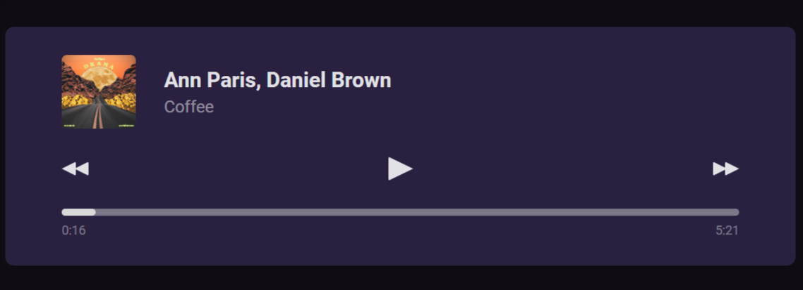

## Player de Musica

 

### Projeto proposto para reproduzir a interface de um player de musica.

#### Utilizado Vite JS como build tool para criação do projeto em REACT e SASS. Feito interações na interface atraves de Hooks Js, yais como useEffect e UseState.

## Features
- ViteJS
- React JS
- SASS
- NPM

## Getting Started
Utilize um gerenciado de pacotes para os comando abaixo e node JS

Clone o repositorio do github
`https://github.com/Du-devBR/challenge-musicPlayer.git`

Instalação via NPM
`npm install`

Run
`npm run dev`
